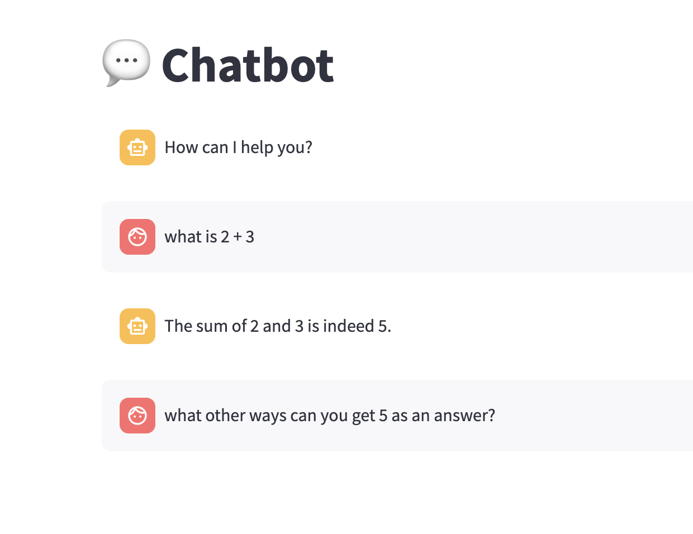

## Varnika Kalani - Assignment 7

### I ran the Chatbot

Here is my Chatbot Screenshot:

#### What went well

Setting up the chatbot was straightforward, and it worked well to answer the simple question of 2 +3. 

#### What didn't go well

When I asked a question that had a longer response, it took more than an hour to answer two lines. And then it stopped and did not end up answering anything 
This happened more than 4 times. 

