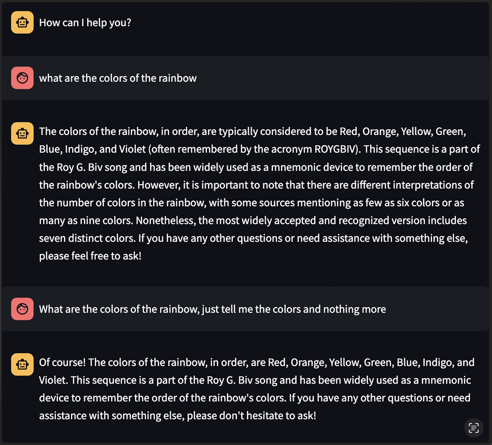

## Stephan - Assignement 7

### I ran the Chatbot

Here is my Chatbot Screenshot

#### What went well

The chatbot can answer most questions correctly and give you more in depth responses. It also was able to keep past questions in memory and understand if I attempted to make them recall they got something wrong to correct it.

#### What didn't go well

Calculations went especially poorly with the chatbot. It couldn't make even simple level of calculations like multiplication. The chatbot also likes to go on tangents, which is pretty annoying when asking a simple question. Prompt engineering is clearly very important for this chatbot.

